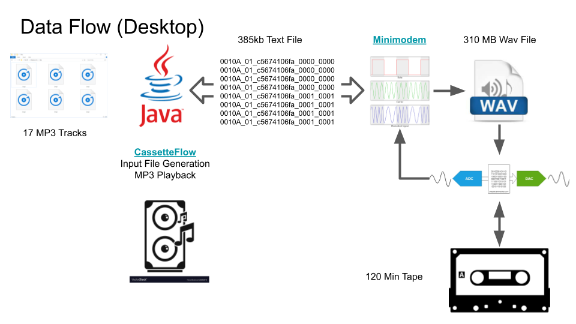

# CassetteFlow Java GUI
A simple Java program meant for the creation of input files and as a technology 
testbed for the CassetteFlow system, currently under development using the 
[ESP32LyraT](https://docs.espressif.com/projects/esp-adf/en/latest/get-started/get-started-esp32-lyrat.html) 
audio board.

CassetteFlow is a somewhat impractical, but fun project to make use of ESP32-LyraT 
board, old school audio cassette tapes containing encoded data, and MP3 files in 
an attempt to simulate digital music playback from an analog compact audio cassette. 
Essentially, the data stored on the cassette will be used to control the playback 
of MP3 files stored on the Desktop and hopefully the ESP32-LyraT board transparently. 
So for all practical purposes, it would seem that a typical audio cassette is 
outputting high quality digital audio. In order to accomplish this it makes use 
of the excellent [Minimodem](https://github.com/kamalmostafa/minimodem) 
program to encode the generate input files to wav files for recording onto 
cassette tapes, as well has decoding data from cassettes.

## Installation and Running
Since this project is in very early development, I haven't put together a 
binary release as yet. However, if you a familiar with Java programming, it 
should be pretty straight forward to compile/run it. The difficult part, 
if you are on Windows, in getting the Minimodem program installed under Cygwin. 