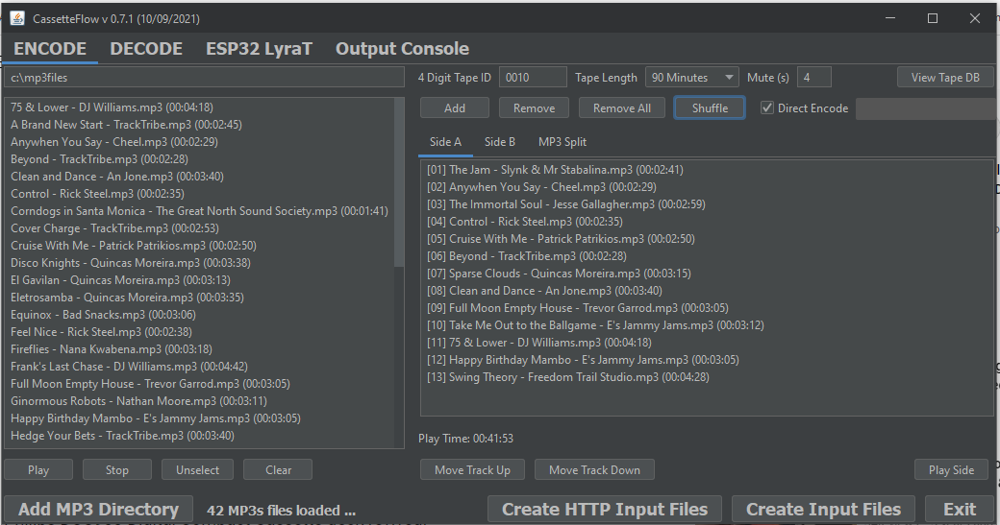
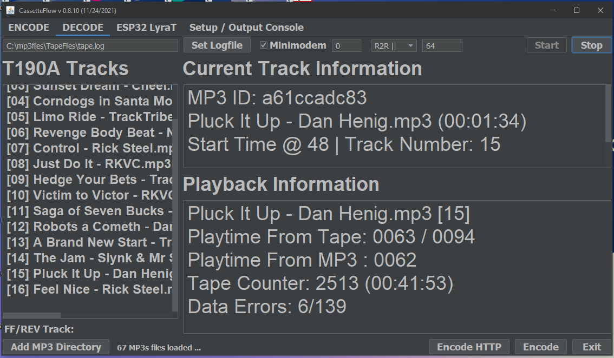
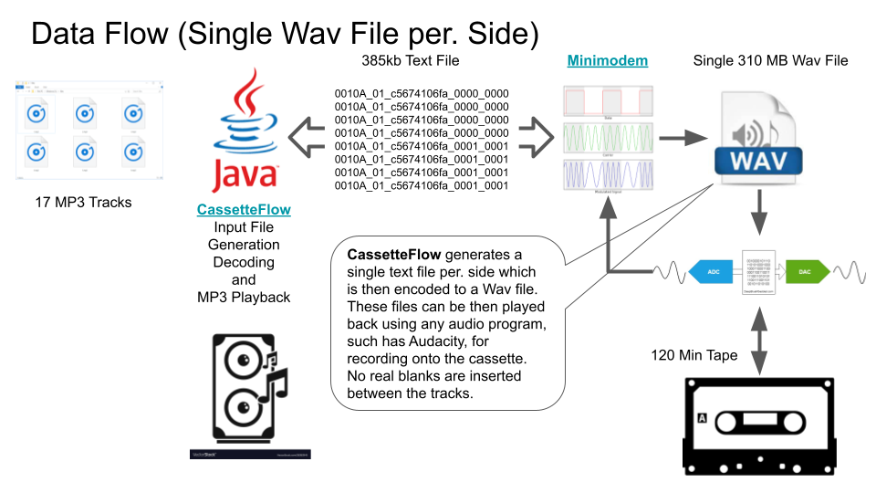
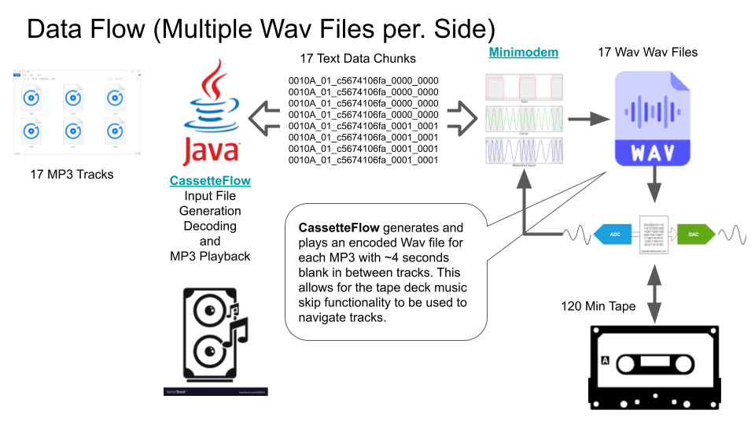
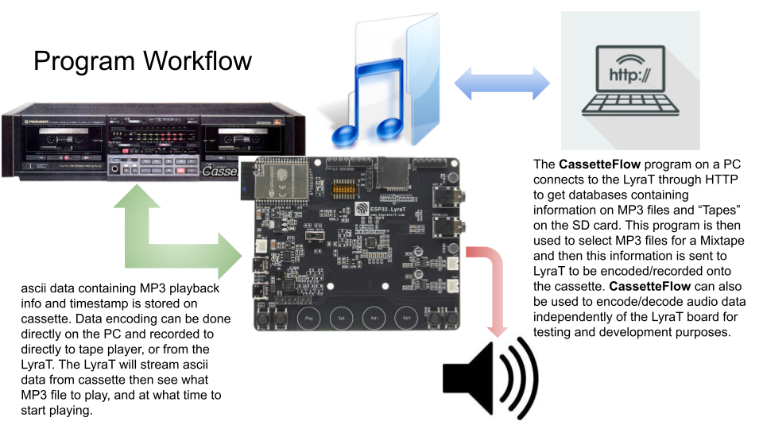

# CassetteFlow Java GUI
A simple Java program meant for the creation of input files and as a technology 
testbed for the CassetteFlow system, currently under development using the 
[ESP32LyraT](https://docs.espressif.com/projects/esp-adf/en/latest/get-started/get-started-esp32-lyrat.html) 
audio board.

## Introduction
CassetteFlow is a somewhat impractical project to make use of ESP32-LyraT 
board, old school audio cassette tapes containing encoded data, and MP3 files in 
an attempt to simulate digital music playback from an analog compact audio cassette. 
Essentially, the data stored on the cassette will be used to control the playback 
of MP3 files stored on the Desktop and hopefully the ESP32-LyraT board transparently. 
So for all practical purposes, it would seem that a typical audio cassette is 
outputting high quality digital audio. In order to accomplish this it makes use 
of the excellent [Minimodem](https://github.com/kamalmostafa/minimodem) 
program to encode the generate input files to wav files for recording onto 
cassette tapes, as well has decoding data from cassettes.

Please note that this project is not meant to as a way to get cassettes to sound 
good. With the proper deck and tape type the audio from a cassette that sound 
pretty good, even close to CD quality. 

## Installation
Here are key steps to install and run the program on Windows, Mac, or Linux.

1. Install Oracle [JRE 8](https://www.java.com/en/download/manual.jsp) or above 
(Tested with both Java 8 and 17). When using OpenJDK 8 on Raspian the MP3 player 
did not work correctly.
2. Install Minimodem for your particular operating system [Linux](http://www.whence.com/minimodem/), 
[Mac OS + Brew](https://brewinstall.org/install-minimodem-on-mac-with-brew/), or 
[Windows 10 + Cygwin](https://github.com/kamalmostafa/minimodem/blob/master/README.windows).
3. Download and unzip the [CassetteFlow.zip](CassetteFlow.zip) release and 
extract it to the folder of your choice.
4. Open a Terminal window (On Windows, this must be the Cygwin Terminal), 
change to the folder where CassetteFlow was unpack then run 
"java -jar CassetteFlow.jar" no quotes. If everything installed correctly then 
the program GUI should display on the screen.

The installation of the Minimodem program can be skipped if you only want to 
make regular audio tapes from the loaded MP3s. Just add the MP3s to the 
"Tape Side" list, then press "Play Side" to automatically play all the MP3s with
a 4 second blank section in between each track. Having these blank sections 
will allow the AMS to be used on tape decks containing this functionality.  

## Using
Coming soon