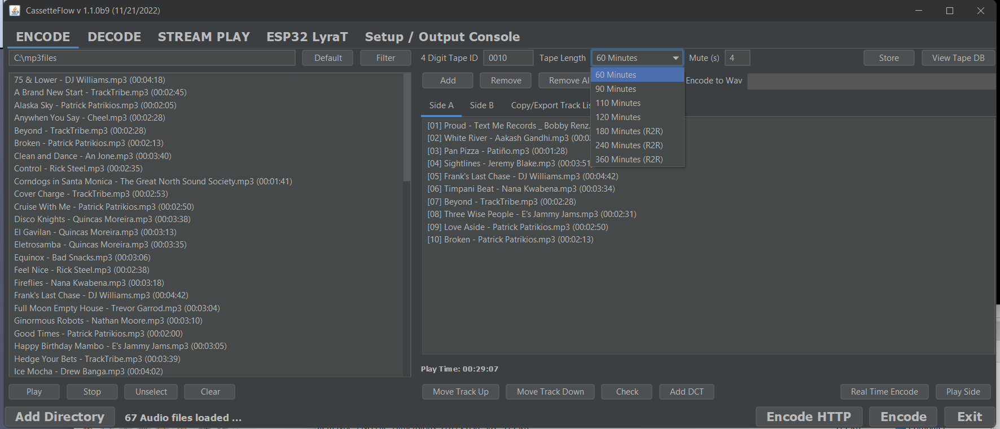
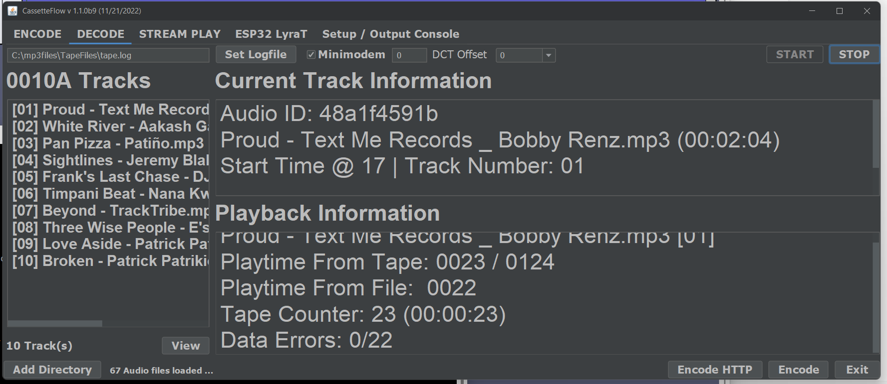

# CassetteFlow Java GUI
A simple Java program meant for the creation of input files and as a technology 
testbed for the CassetteFlow system, currently under development using the 
[ESP32LyraT](https://docs.espressif.com/projects/esp-adf/en/latest/get-started/get-started-esp32-lyrat.html) 
audio board.

## Introduction
CassetteFlow is a project to make use of ESP32-LyraT board, old school audio 
cassette tapes containing encoded data, and MP3/FLAC files in an attempt to 
simulate digital music playback from an analog audio cassette or reel to reel (R2R). 
Essentially, the data (track list and time code) stored on the cassette is used 
to control the playback of MP3/FLAC files stored on the Desktop, RPi or 
ESP32-LyraT board transparently. So for all practical purposes, it would seem 
that a typical audio cassette or R2R is outputting high quality digital audio. 
Think of it has having the Playlist on the cassettes instead of the audio. This 
system is especially useful for bring new life into vintage tape decks which are 
mechanically fine, but can no longer output decent analog audio, and wouldn't 
be worth fixing.   

In order to accomplish this it makes use of the excellent 
[Minimodem](https://github.com/kamalmostafa/minimodem) program to encode the 
generate text input files to wav files for recording onto tape, as well has 
decoding data from cassettes/R2R.

Please note that this project is not meant to as a way to get cassettes/R2R to 
sound good. With the proper deck, tape type, and NR technology the audio 
can sound pretty good, even matching or coming close CD quality.  Such a setup 
cost in todays day and age though :) 

## Installation
Here are the key steps to install and run the program on Windows, Mac, or Linux.

1. Install Oracle [JRE 8](https://www.java.com/en/download/manual.jsp) or above 
(Tested with both Java 8 and 17). When using OpenJDK 8 on Raspian the MP3 player 
did not work correctly.
2. Install Minimodem for your particular operating system [Linux](http://www.whence.com/minimodem/), 
[Mac OS + Brew](https://brewinstall.org/install-minimodem-on-mac-with-brew/), or 
[Windows 10 + Cygwin](https://github.com/kamalmostafa/minimodem/blob/master/README.windows).
3. Download and unzip the [CassetteFlow.zip](CassetteFlow.zip) release and 
extract it to the folder of your choice.
4. Open a Terminal window (On Windows, this must be the Cygwin Terminal), 
change to the folder where CassetteFlow was unpack, then run 
"java -jar CassetteFlow.jar" no quotes. If everything installed correctly, then 
the program GUI should display on the screen.

The installation of the Minimodem program can be skipped if you only want to 
make regular audio tapes from the loaded MP3s or FLAC. Just add the audio files to 
the "Tape Side" list, then press "Play Side" to automatically play all the files 
with a 4 second blank section in between each track. Having these blank sections 
will allow the AMS to be used on tape decks containing this functionality.  

## Using
In addition to allowing the creation of regular analog recordings, this 
program also allows for some unique capabilities when used for recording 
CF encoded tapes. For one, it allows for attaching track list information for 
long mixes (i.e. YouTube mixes), synch with the playback time.  Secondly, it now 
possible to dynamically select the audio files linked to a specially CF encode 
tape. This makes it possible to easily create "mixtapes" without having to 
specifically record the matching CF data onto a tape everytime.