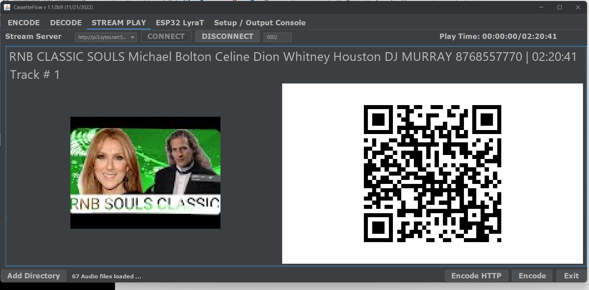
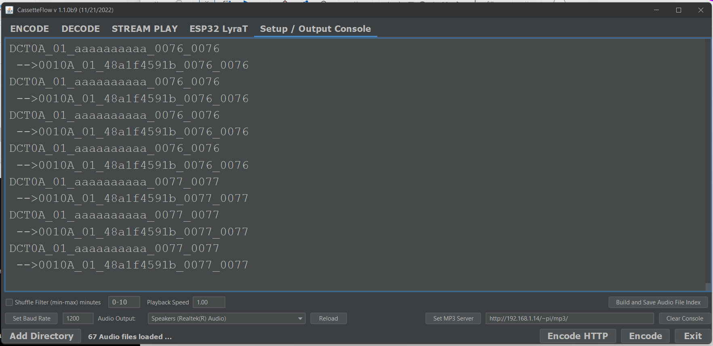
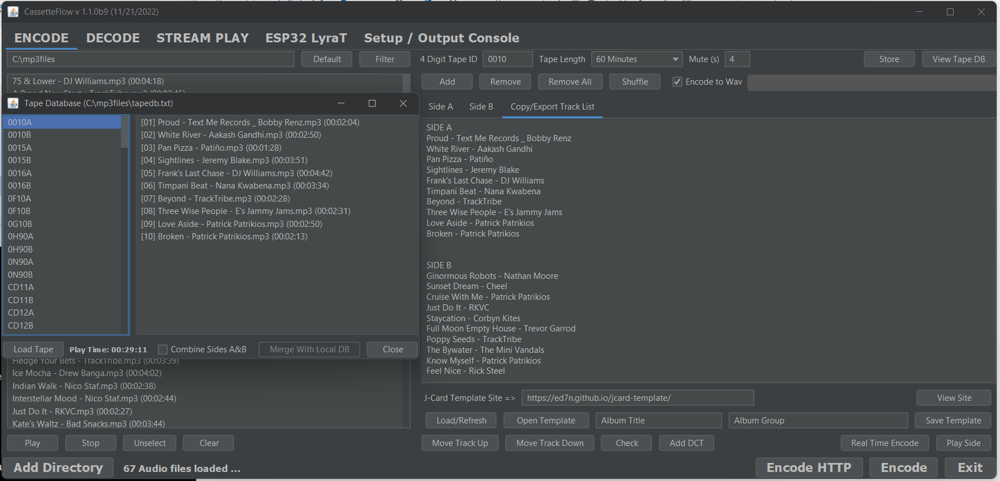
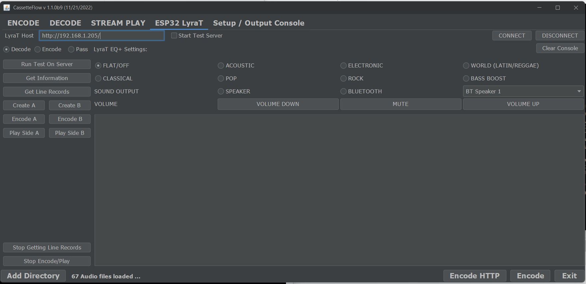

# CassetteFlow Java GUI

A simple Java program meant for the creation of input files and as a technology 
testbed for the CassetteFlow system, previously under development using the 
[ESP32LyraT](https://docs.espressif.com/projects/esp-adf/en/latest/get-started/get-started-esp32-lyrat.html) audio board, but now moving to the [M5Stack Tab5](https://docs.m5stack.com/en/core/Tab5).

## Introduction

CassetteFlow is a project to make use of old school audio cassette tapes 
containing encoded data, and MP3/FLAC files in an attempt to simulate digital 
music playback from an analog audio cassette, reel to reel (R2R), and even custom vinyl records by https://www.freestyle-vinyl.com/ . Essentially, the data (track list and time code) stored on the analog media is used to control the playback of MP3/FLAC files stored on the Desktop, RPi or ESP32-LyraT board transparently. So for all practical purposes, it would seem that a typical audio cassette, vinyl record, or R2R is outputting high quality digital audio. Think of it has having the Playlist on the analog media instead of the analog audio. This system is especially useful for bring new life into vintage audio equipment which are mechanically fine, but can no longer output good quality audio and they wouldn't be worth fixing givin the time and cost involved.

The latest release (**v2.0.x**) focuses on using an integrated Minimodem like encoder/decoder, improve playback control of Spotify Tracks and YouTube videos, as well as making easier for creating analog tapes using the "PlaySide" functionality. There is also basic support for jcard creation using the website [https://ed7n.github.io/jcard-template/]()

In order to accomplish this, it use to depend on the excellent [Minimodem](https://github.com/kamalmostafa/minimodem) program to encode the generate text input files to wav files for recording onto the analog media, as well has decoding data. Now it makes use of a pure Java FSK implementation (JMinimodem) which removes the need for Minimodem entirely.

Please note, this project is not meant to as a way to get cassettes/R2R to 
sound good. With the proper deck, tape type, and NR technology the audio 
can sound pretty good, even matching or coming close CD quality. That's just expensive and time consuming in this day and age to accomplish :)

## Installation

Here are the key steps to install and run the program on Windows, Mac, or Linux.

1. Install Oracle [JRE 8](https://www.java.com/en/download/manual.jsp) or above (Tested with Java 8, 17, 21, 25). When using OpenJDK 8 on Raspian the MP3 player did not work correctly.
2. Download and unzip the [CassetteFlow.zip](CassetteFlow.zip) release and 
   extract it to the folder of your choice.
3. Open a Terminal window change to the folder where CassetteFlow was unpack, then run "java -jar CassetteFlow.jar" no quotes. If everything installed correctly, then the program GUI should display on the screen.

If you only want to make regular audio tapes from the loaded MP3s or FLAC. Just add the audio files to the "Tape Side A/B" list, then press "Play Side" to automatically 
play all the files with a 4 second blank section in between each track. Having these blank sections allows the AMS to be used on tape decks containing this functionality. There is also basic support for the creation of jcards from the tracks in the Side A/B list as well.

## Using

In addition to allowing the creation of regular analog recordings, this 
program also allows for some unique capabilities when used for recording 
CF (CassetteFlow) encoded tapes. For one, it allows for attaching track list 
information for long mixes (i.e. YouTube mixes), synched to the playback time. 
The track list information is stored in a tab delimitted [tracklist.txt](text file). 
Secondly, it's now possible to dynamically select the audio files and link them 
to a specially CF encode tape. These are called Dynamic Content Tracks, DCT, and 
make it possible to easily create "Mixtapes" without having to specifically 
record the matching CF data onto a tape every time.

## To-Do

1. Make usage video

2. Improve User Inerface